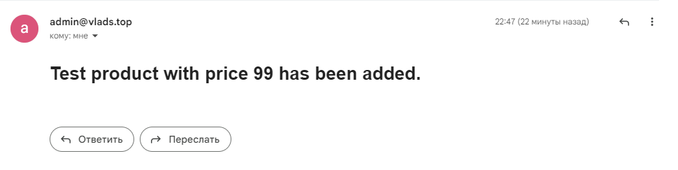

# How to start

### Run database locally

To run database locally use existing MS SQL database with this local credentials which are defined in
`appsettings.json` file: `Server=localhost;Database=localdb;User Id=sa;Password=P@ssw0rd;`. If there are no local
database, use simple [Docker](https://www.docker.com/) command to create it:
`docker run -e ‘ACCEPT_EULA=Y’ -e ‘SA_PASSWORD=P@ssw0rd’ -p 1433:1433 -d mcr.microsoft.com/mssql/server:2017-latest`.

### Run RabbitMQ locally

Use 2 simple [Docker](https://www.docker.com/) commands to create local Rabbit MQ:

`docker run -d --hostname my-rabbit-host --name my-rabbit -e RABBITMQ_DEFAULT_USER=user -e RABBITMQ_DEFAULT_PASS=password rabbitmq:3-management`

and

`docker run -it --rm --name rabbitmq -p 5672:5672 -p 15672:15672 rabbitmq:3-management`

After that, if you go to http://localhost:15672 in your browser, you will find working Rabbit MQ broker. Creds are: `guest/guest`

### Email service

Set up SMTP server in `appsettings.json` file. Otherwise it email service will not work. Example of it's proper work:

___

# Architecture diagram
